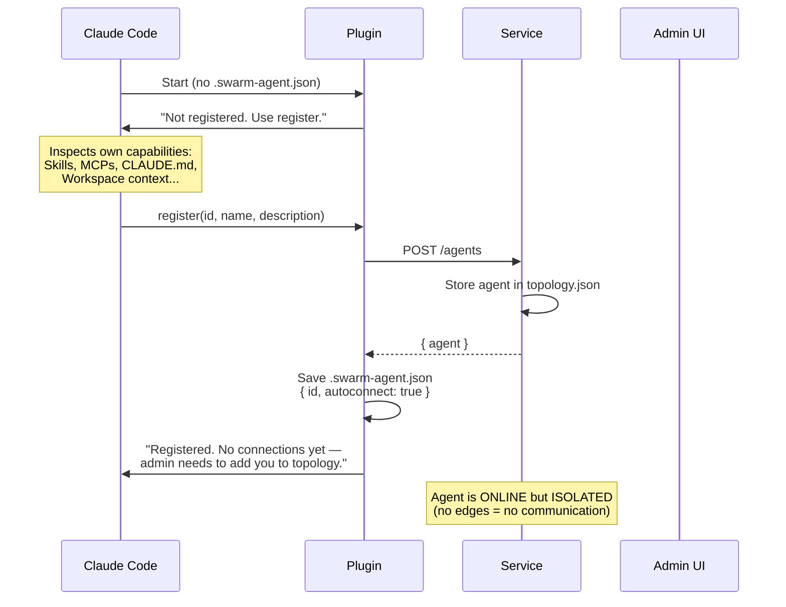
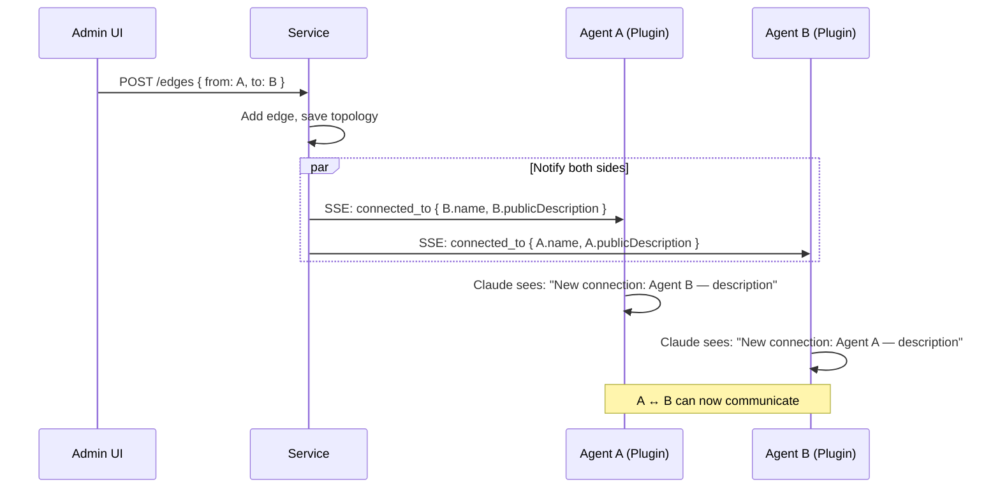
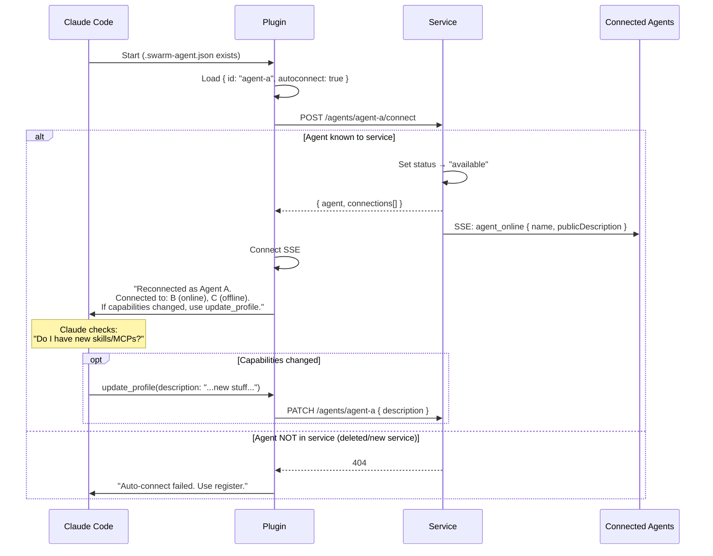
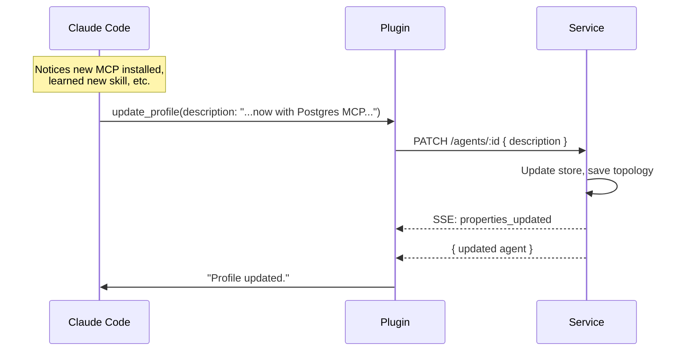
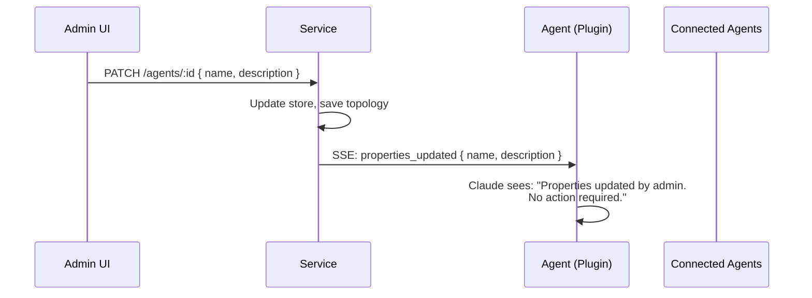
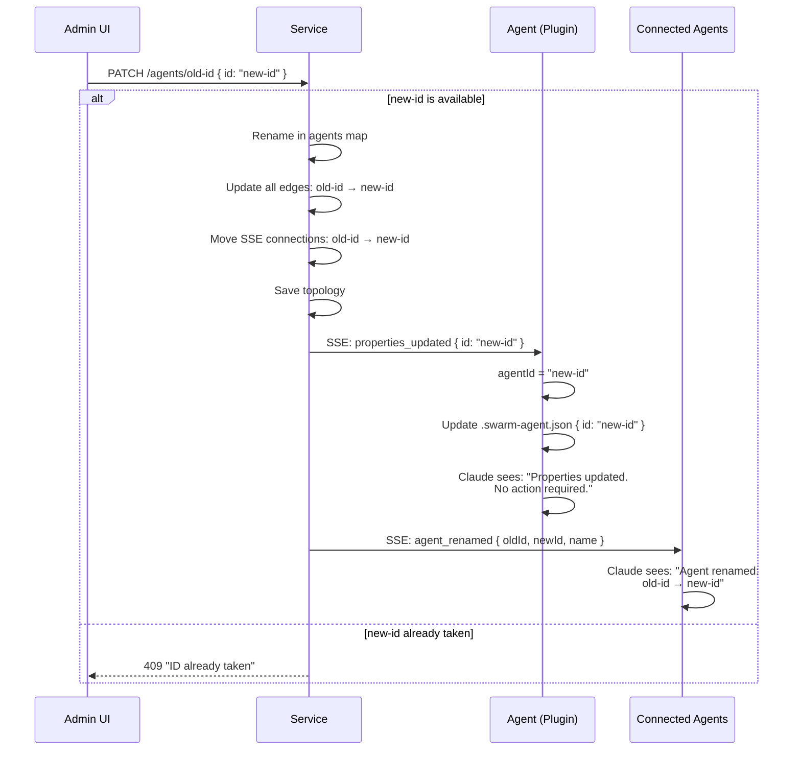
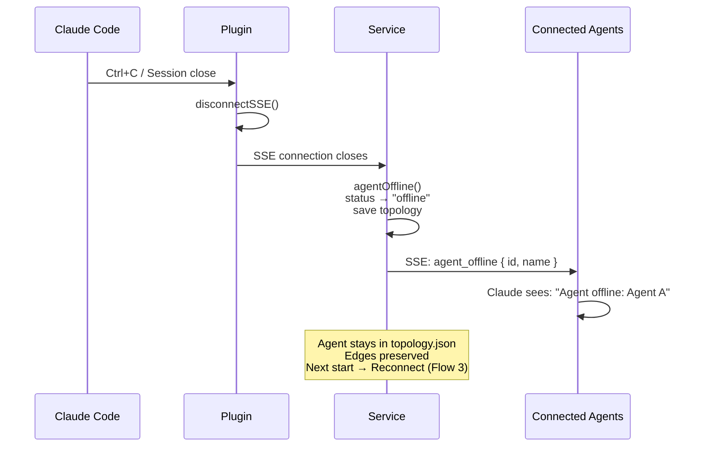
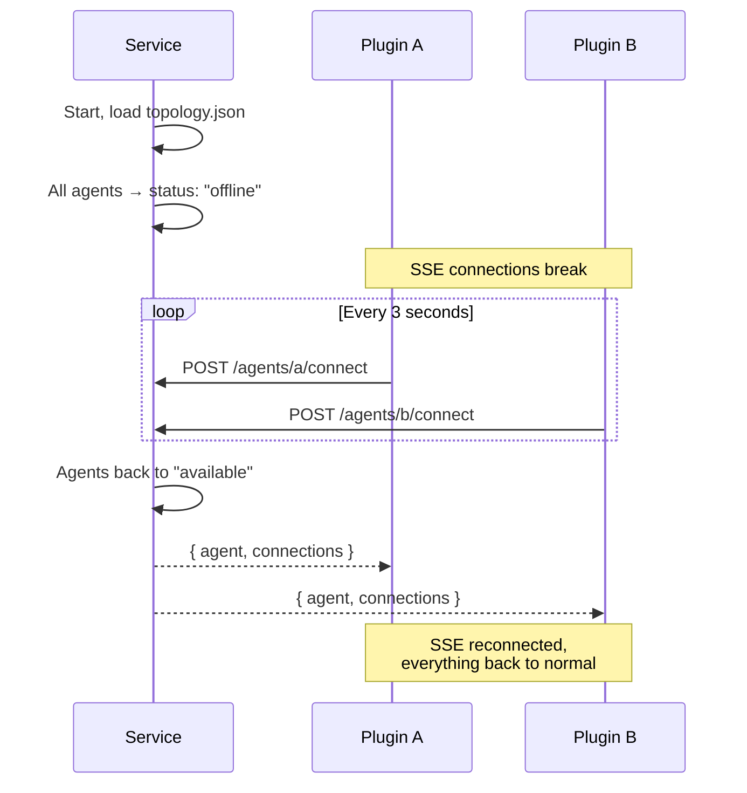
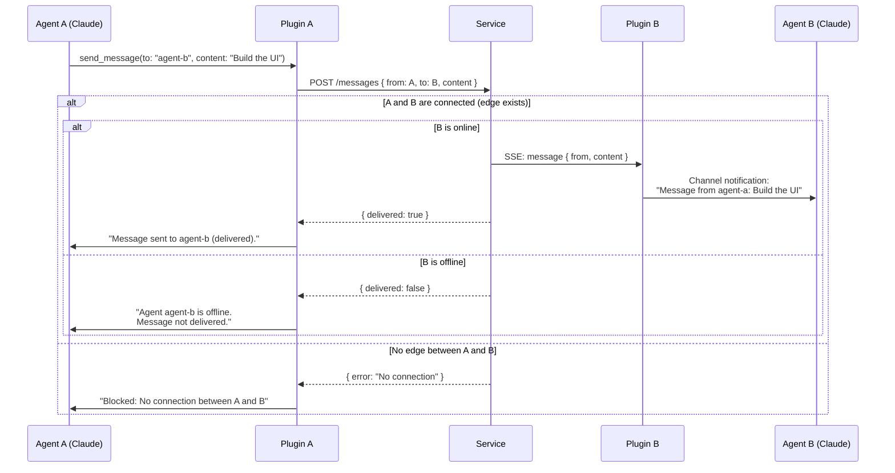
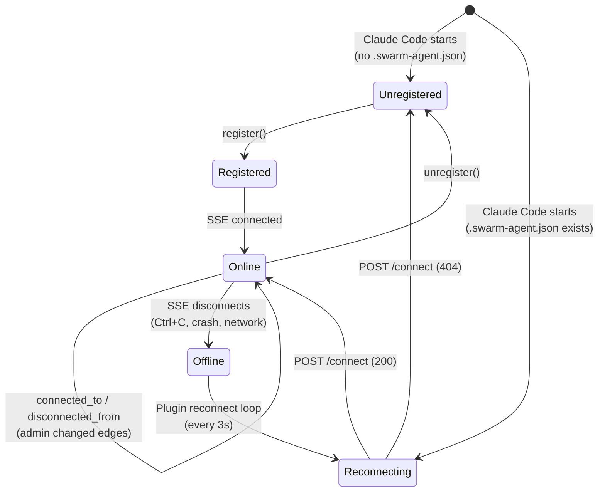

# Agent Lifecycle

## 1. First Registration

## 2. Admin Connects Agents (Edge)

## 3. Reconnect (Next Startup)

## 4. Agent Updates Own Profile

## 5. Admin Changes Properties in UI

## 6. Admin Changes Agent ID in UI

## 7. Disconnect (Session Ends)

## 8. Service Restart

## 9. Communication (Message Flow)

## State Diagram

